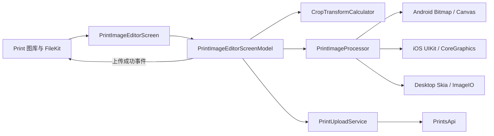

# VRChat Print 图片编辑与 PNG 转换设计

- 日期：2026-07-20
- 状态：已批准
- 目标分支：`codex/avatar-print-profile-actions`
- 设计基线：`c987ca87bf922d4df566cf207f5cd91f8c0f8ebc`

## 背景

PR #13 当前在 Print 图库页通过 FileKit 只选择 PNG，并在选择后立即读取字节上传。这个流程不能处理 JPEG、HEIC 等常见照片，也没有让用户按 VRChat Print 的展示区域选择裁剪内容。

仓库已有 `ImageEditorScreen` 和 `ImageEditorConfig`，但没有调用方。该页面假定所有图片都是 1920×1080，确认时直接返回原路径，没有执行裁剪、缩放或编码；`Print` 配置仍为 `TODO()`。本功能删除这套假实现，并新增真实的 Print 专用流程。

## 已知事实与外部依据

社区维护的 VRChat OpenAPI 对 `/prints` 只明确以下要求：

- 请求使用 `multipart/form-data`。
- `image` 是 PNG 二进制文件。
- `timestamp` 是必填字段。

该文档没有规定图片比例、分辨率或内容边距：

- <https://github.com/vrchatapi/specification/blob/main/openapi/components/paths/prints.yaml>

开源工具 Send to VRC 的实际代码会生成 2048×1440 PNG，并把 1920×1080 的照片内容放入白色画布：

- <https://github.com/cathiecode/send-to-vrc/blob/72fa0f0725e750c16079960cde8276518cb8906d/src-tauri/src/vrchat_print.rs>

该代码的横向偏移为 64，纵向偏移实际使用 69，但相邻注释写 96。由于这不是官方规范，首版采用运行代码中的 `(64, 69)`，并将参数集中到 `PrintCanvasSpec`。真实 VRChat 上传与显示检查是合并前验收项；若结果不正确，只修改该配置和对应契约测试。

## 目标

1. 允许用户选择 JPEG、PNG、HEIC/HEIF 静态照片。
2. 选择后进入固定 16:9 编辑页，而不是立即上传。
3. 支持拖动、缩放、左右旋转 90°、水平翻转、垂直翻转和重置。
4. 将选定内容稳定渲染为 1920×1080，再包装成符合当前已知 Print 结构的 2048×1440 PNG。
5. 在编辑页直接上传；处理或上传失败时保留编辑状态并允许重试。
6. 保持公共 UI、像素处理和网络上传之间的职责边界，使三端实现可以独立验证和替换。

## 非目标

- 任意比例或自由尺寸裁剪。
- 调整可移动、可缩放的裁剪框。
- 滤镜、亮度、颜色、文字、贴纸或绘画工具。
- GIF、动画 WebP 或视频；文件选择器不提供这些格式。
- 保证每个平台都能解码 HEIC/HEIF。第一版使用平台解码能力，不支持时提示改用 JPEG/PNG。
- 在编辑页展示 VRChat 的白色 Print 包装画布。用户只编辑 16:9 照片内容。
- 同时改造 Icon、Emoji、Sticker 和 Gallery 的图片上传流程。

## 用户流程

1. 用户在 Print 标签页点击新增按钮。
2. FileKit 系统选择器允许选择 `.jpg`、`.jpeg`、`.png`、`.heic` 和 `.heif`。
3. 应用读取文件字节并探测真实格式。扩展名只用于选择器和文件名，不作为解码成功的依据。
4. 解码成功后进入编辑页；EXIF 方向已经归一化。
5. 用户在固定 16:9 裁剪框下移动和缩放图片，也可以旋转、翻转或重置。
6. 用户点击“上传”。编辑器生成 Print PNG，并在同一页面上传。
7. 上传成功后返回 Print 图库并刷新列表。
8. 处理或上传失败时留在编辑页，保留当前构图，并显示可操作的错误信息。

## 编辑页交互

### 布局

- 顶部应用栏包含返回、标题和唯一强调操作“上传”。
- 中央为深色工作区和固定 16:9 裁剪窗口。窗口外显示半透明遮罩，窗口内显示三分法网格。
- 底部工具栏包含左旋、右旋、水平翻转、垂直翻转、缩放滑杆和重置。
- 宽屏使用单行工具栏；窄屏将缩放和变换工具分为两行，但裁剪窗口比例不变。
- 图标按钮使用项目现有图标集；不熟悉的桌面图标提供 tooltip，所有按钮提供无障碍描述。

### 手势和状态规则

- 裁剪框不移动。单指或鼠标拖动图片；双指、滚轮或滑杆调整缩放。
- 缩放范围是当前最小覆盖缩放的 1 到 3 倍。
- 图片始终完整覆盖裁剪窗口，不允许拖出透明或空白区域。
- 旋转以图片中心为基准，每次为 90°。旋转后重新计算最小缩放，并尽量保留旋转前的视觉中心。
- 翻转以图片中心为轴，可同时存在水平和垂直翻转。
- 重置恢复 EXIF 方向归一化后的居中覆盖状态。
- 视口尺寸变化时，构图使用归一化坐标重新映射，不因窗口或设备旋转而漂移。
- 生成和上传期间禁用编辑、重复上传和返回操作。请求完成后恢复；第一版不提供单独的取消上传按钮。

## 架构



### `PrintImageEditorScreen`

位于 `commonMain`，只负责 Compose 布局、手势和渲染 `EditorUiState`。它不直接解码、编码或调用 `PrintsApi`，也不拼装 2048×1440 画布。

删除现有未使用的 `ImageEditorScreen` 和 `ImageEditorConfig`，新增 `PrintImageEditorScreen`，避免保留一个看似通用但没有真实行为的入口。首版不建立跨所有 `FileTagType` 的编辑器抽象。

### `PrintImageEditorScreenModel`

负责一次编辑会话：

- 加载源字节和预览。
- 持有编辑参数及当前阶段。
- 调用公共变换计算器约束手势。
- 按顺序调用处理器和上传服务。
- 将失败映射为可展示状态。
- 只在上传成功后发送完成事件。

建议的阶段为 `Loading`、`Ready`、`Processing` 和 `Uploading`。错误作为独立字段附着在可恢复状态上，避免错误后丢失预览和编辑参数。ScreenModel 只允许存在一个处理/上传 Job。

### `CropTransformCalculator`

位于 `commonMain`，是不依赖 Compose 和平台图片 API 的纯 Kotlin 逻辑。输入包括归一化后的源尺寸、裁剪视口尺寸和编辑操作；输出包括受约束的 `CropTransform` 与最终 `RenderPlan`。

`CropTransform` 至少包含：

- 归一化视觉中心 `centerX`、`centerY`。
- 相对最小覆盖缩放 `scale`。
- `quarterTurns`，值为 0 到 3。
- `flipHorizontal` 和 `flipVertical`。

UI 预览和最终输出必须使用同一套计算结果，不能分别实现两套裁剪公式。

### `PrintImageProcessor`

在 `commonMain` 定义接口，通过现有平台 Koin module 注册三端实现。接口只交换公共数据：源字节、预览 `ImageBitmap`、尺寸、`RenderPlan`、PNG 字节和分类错误；平台 Bitmap、UIImage、CGImage 或 Skia Image 不泄漏到公共层。

主要能力：

```kotlin
suspend fun prepare(source: SelectedImage): PreparedImage
suspend fun render(source: SelectedImage, plan: RenderPlan, spec: PrintCanvasSpec): ByteArray
```

`prepare` 探测格式、读取尺寸和方向并生成受限尺寸的预览。`render` 重新从原始字节生成最终输出，不能截图或放大当前 Compose 视口。

平台职责：

- Android：使用 Bitmap 解码和 Canvas/Matrix 渲染；根据系统版本和设备解码能力处理 HEIC/HEIF；正确应用 EXIF 方向。
- iOS：使用 UIKit/CoreGraphics 解码、方向归一化、变换和 PNG 编码。
- Desktop：使用 Compose Desktop 已携带的 Skia 能力和 ImageIO 解码 JPEG/PNG；HEIC/HEIF 只有在当前解码器实际支持时才接受。

### `PrintUploadService`

从 UI 和像素处理层隔离认证重试与 `PrintsApi` 调用。它接收已经验证的 PNG 字节和 `.png` 文件名，返回成功数据或失败，不负责 Toast、导航或编辑状态。

将现有 `GalleryScreenModel.uploadPrint` 的 fire-and-forget 上传逻辑迁移到该服务，并从 `GalleryScreenModel` 删除该方法，避免编辑页无法知道真实完成时机。图库模型仍负责读取和刷新 Print 列表；编辑页上传成功后通过完成回调请求图库模型刷新。`GalleryScreenModel` 不注入平台处理器，`PrintImageEditorScreenModel` 也不依赖 `GalleryScreenModel`。

## 图片处理和输出契约

### 输入

- 稳定支持 JPEG 和 PNG。
- 尝试支持 HEIC/HEIF；能力探测失败时返回 `UnsupportedFormat`。
- 不信任文件扩展名或 MIME 字符串，必须通过解码器验证内容。
- 透明 PNG 在最终白色画布上合成，不能把未初始化或透明背景带入 Print。
- 为避免异常文件耗尽内存，编码文件上限为 50 MiB，声明像素总数上限为 100 megapixels。限制值集中配置并显示明确错误。

### 预览与内存

- 预览最长边不超过 2048 像素，并按屏幕所需尺寸降采样。
- 原始解码位图不在 Composable 或 ScreenModel 中长期持有。
- 最终渲染根据裁剪区域选择足够达到 1920×1080 的解码尺寸，避免无条件展开整张超大照片。
- 解码、变换、编码和上传均离开 UI dispatcher 执行。
- 页面退出后释放源字节、预览和平台资源。

### `PrintCanvasSpec`

首版固定配置：

| 参数 | 值 |
| --- | ---: |
| 内容宽度 | 1920 |
| 内容高度 | 1080 |
| 画布宽度 | 2048 |
| 画布高度 | 1440 |
| 内容 X 偏移 | 64 |
| 内容 Y 偏移 | 69 |
| 背景 | 不透明白色 |
| 编码 | PNG |

处理顺序：

1. 按 EXIF 将源图归一化为正向坐标。
2. 按 `RenderPlan` 应用中心、缩放、四分之一旋转和翻转。
3. 重采样出精确的 1920×1080 内容。
4. 创建 2048×1440 不透明白色画布。
5. 在 `(64, 69)` 绘制内容。
6. 编码 PNG，并验证 PNG 签名与 IHDR 尺寸。
7. 以 `print-<timestamp>.png` 作为上传文件名。

`PrintsApi` 继续执行上传前 PNG 防御性检查。尺寸和画布结构由处理器的输出契约保证，API 层不理解裁剪参数。

## 错误处理

处理器返回可分类错误，而不是把所有失败压成消息字符串：

- `FileTooLarge`
- `ImageDimensionsTooLarge`
- `UnsupportedFormat`
- `DecodeFailed`
- `RenderFailed`
- `EncodeFailed`

网络侧保留认证、VRC+ 权限、超时和普通服务端错误的既有区分。展示规则：

- 选择后无法解码：不进入编辑页，提示当前平台不支持，并建议 JPEG/PNG。
- 编辑页处理失败：保留构图，恢复控件，允许再次上传。
- 网络、认证或权限失败：保留已经生成的 PNG 和构图；重试时直接复用 PNG，不重复编码。
- 用户再次修改构图后，丢弃缓存 PNG；下一次上传重新生成。
- 所有用户可见字符串加入英语、日语、简体中文和繁体中文资源，不在 ScreenModel 中硬编码。

## 测试

### 公共单元测试

- 不同源比例和视口尺寸下的最小覆盖缩放。
- 平移约束永远不暴露空白区域。
- 四个旋转状态以及水平、垂直、组合翻转。
- 旋转后视觉中心保留和重置行为。
- 视口尺寸变化后的归一化映射。
- `RenderPlan` 在预览与输出间使用相同参数。
- 状态机拒绝重复上传，失败保留状态，成功才发送完成事件。
- 修改构图会使已生成 PNG 缓存失效。

### 平台处理测试

测试资源至少包含：横向 JPEG、纵向 JPEG、带 EXIF 方向的 JPEG、透明 PNG、损坏文件，以及条件允许时的 HEIC。

- JPEG/PNG 在三端成功生成预览和输出。
- EXIF 方向归一化后尺寸与构图方向正确。
- HEIC 在支持的平台成功；不支持的平台返回 `UnsupportedFormat`，不能崩溃或返回空图片。
- 输出 PNG 尺寸为 2048×1440。
- 内容区域为 1920×1080 且起点符合 `PrintCanvasSpec`。
- 外围像素为不透明白色。
- 不使用整图哈希比较跨平台缩放结果；关键像素和边界使用合理容差。

### API 与集成测试

- 保留 `PrintsApi` 的非 PNG 上传前拒绝测试。
- 验证 multipart 使用 `image/png` 和 `.png` 文件名。
- 验证处理失败时不发网络请求。
- 验证上传失败后重试复用缓存 PNG。
- 验证成功事件触发 Print 列表刷新和返回导航。

### 构建与手工验收

- 运行 `commonTest`。
- 编译 Desktop、Android Debug 和 iOS Simulator Arm64。
- 在触控设备验证拖动、捏合、旋转和翻转。
- 在桌面验证拖动、滚轮、滑杆和 tooltip。
- 使用大尺寸手机照片验证内存和响应性。
- 模拟断网验证保留状态和重试。
- 使用有 VRC+ 权限的真实账号至少上传一次，确认 VRChat 中内容位置和白色边距正确。该项未通过时不得合并。

## 完成标准

- 选择有效且未超过安全限值的 JPEG/PNG 后进入可操作的 16:9 编辑页。
- HEIC/HEIF 在平台支持时可编辑，不支持时给出明确可恢复提示。
- 预览构图与输出内容一致，旋转和翻转不会产生空白边缘。
- 上传字节是尺寸正确的 PNG，不依赖原始文件扩展名。
- 上传失败不会丢失用户构图，重复点击不会发起并发请求。
- 三端构建和自动化测试通过。
- 真实 VRChat 上传验收确认 `(64, 69)` 画布参数可用。

## 已确认决策

- 固定裁剪框，移动和缩放图片。
- 编辑器只展示 16:9 内容，不展示 Print 包装画布。
- 公共编辑器配合平台图片处理器。
- 支持旋转和双向翻转。
- 编辑页直接上传，成功后返回图库。
- HEIC 使用平台能力并提供降级提示，不捆绑额外原生编解码器。

本设计没有待定产品决策。唯一需要运行时验证的外部假设是 VRChat Print 内容的纵向偏移；该风险已经由集中配置、契约测试和真实上传验收覆盖。
